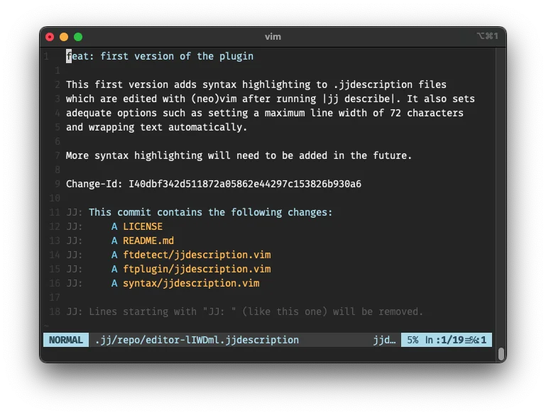

# .jjdescription files plugin for Vim
This plugin adds syntax highlighting, sensible options, and diff viewing for
.jjdescription files. These are temporary files created by [JJ][1] and opened
in your configured editor when you run `jj describe`, so you can write a
description for your change.



## Installation
Use your favorite plugin manager to install the `avm99963/vim-jjdescription`
plugin. For instance, with [vim-plug][2] you should add the following to the
appropriate section in your `.vimrc`:

``` vimscript
Plug 'avm99963/vim-jjdescription'
```

## Features

### Diff Viewing
The plugin provides a `:JJDiff` command that shows the changes for the revision
being described. To automatically show the diff in a split window when editing
descriptions, add this to your `.vimrc`:

``` vimscript
" Show JJ diff in a vertical split on the right
autocmd FileType jjdescription JJDiff | silent! wincmd P | wincmd L | wincmd p
```

This behaves similarly to how `DiffGitCached` works for git commits:
- The diff appears in a right-side split
- The preview window closes automatically when you quit the description
- Your cursor stays in the description window for editing

The `:JJDiff` command supports additional options:
- `:JJDiff --stat` - Show only statistics
- `:JJDiff --types` - Show file type changes
- `:JJDiff --summary` - Show summary of changes

## Credits
This plugin is based on the native syntax highlighting and ftplugin for
gitcommit, which is the format of the analogous temporary files used by Git.
This is the reason why this plugin is licensed with the Vim license.

[1]: https://github.com/martinvonz/jj
[2]: https://github.com/junegunn/vim-plug
